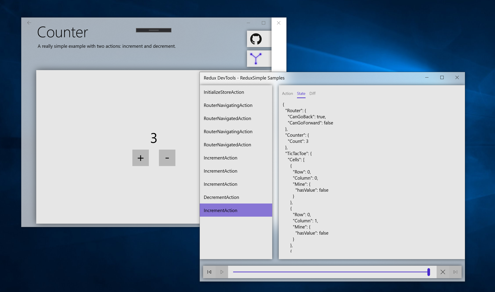

# Redux Simple

[](https://www.codefactor.io/repository/github/odonno/reduxsimple)

| Package                     | Versions                                                                                                                                |
| --------------------------- | --------------------------------------------------------------------------------------------------------------------------------------- |
| ReduxSimple                 | [](https://www.nuget.org/packages/ReduxSimple/)                                 |
| ReduxSimple.Entity          | [](https://www.nuget.org/packages/ReduxSimple.Entity/)                   |
| ReduxSimple.Uwp             | [](https://www.nuget.org/packages/ReduxSimple.Uwp/)                         |
| ReduxSimple.Uwp.RouterStore | [](https://www.nuget.org/packages/ReduxSimple.Uwp.RouterStore/) |
| ReduxSimple.Uwp.DevTools    | [](https://www.nuget.org/packages/ReduxSimple.Uwp.DevTools/)       |

> Simple Stupid Redux Store using Reactive Extensions

Redux Simple is a .NET library based on [Redux](https://redux.js.org/) principle. Redux Simple is written with Rx.NET and built with the minimum of code you need to scale your whatever .NET application you want to design.

## Example app

There is a sample UWP application to show how ReduxSimple library can be used and the steps required to make a C#/XAML application using the Redux pattern.

You can follow this link: https://www.microsoft.com/store/apps/9PDBXGFZCVMS

## Getting started

Like the original Redux library, you will have to initialize a new `State` when creating a `Store` + you will create `Reducer` functions each linked to an `Action` which will possibly update this `State`.

In your app, you can:

- `Dispatch` new `Action` to change the `State`
- and listen to events/changes using the `Subscribe` method

You will need to follow the following steps to create your own Redux Store:

1. Create `State` definition

```csharp
public class RootState
{
    public string CurrentPage { get; set; } = string.Empty;
    public ImmutableArray<string> Pages { get; set; } = ImmutableArray<string>.Empty;
}
```

Each State should immutable. That's why we prefer to use immutable types for each property of the State.

2. Create `Action` definitions

```csharp
public class NavigateAction
{
    public string PageName { get; set; }
}

public class GoBackAction { }

public class ResetAction { }
```

3. Create `Reducer` functions

```csharp
public static class Reducers
{
    public static IEnumerable<On<RootState>> CreateReducers()
    {
        return new List<On<RootState>>
        {
            On<NavigateAction, RootState>(
                (state, action) => state.With(new { Pages = state.Pages.Add(action.PageName) })
            ),
            On<GoBackAction, RootState>(
                state =>
                {
                    var newPages = state.Pages.RemoveAt(state.Pages.Length - 1);
                    return state.With(new {
                        CurrentPage = newPages.LastOrDefault(),
                        Pages = newPages
                    });
                }
            ),
            On<ResetAction, RootState>(
                state => state.With(new {
                    CurrentPage = string.Empty,
                    Pages = ImmutableArray<string>.Empty
                })
            )
        };
    }
}
```

4. Create a new instance of your Store

```csharp
sealed partial class App
{
    public static readonly ReduxStore<RootState> Store;

    static App()
    {
        Store = new ReduxStore<RootState>(CreateReducers());
    }
}
```

5. And be ready to use your store inside your entire application...

## Features

<details>
<summary>Dispatch & Subscribe</summary>
<br>

You can now dispatch new actions using your globally accessible `Store`.

```csharp
using static MyApp.App; // static reference on top of your file

Store.Dispatch(new NavigateAction { PageName = "Page1" });
Store.Dispatch(new NavigateAction { PageName = "Page2" });
Store.Dispatch(new GoBackAction());
```

And subscribe to either state changes or actions raised.

```csharp
using static MyApp.App; // static reference on top of your file

Store.ObserveAction<NavigateAction>().Subscribe(_ =>
{
    // TODO : Handle navigation
});

Store.Select(state => state.CurrentPage)
    .Where(currentPage => currentPage == nameof(Page1))
    .UntilDestroyed(this)
    .Subscribe(_ =>
    {
        // TODO : Handle event when the current page is now "Page1"
    });
```

</details>

<details>
<summary>Reducers</summary>
<br>

Reducers are pure functions used to create a new `state` once an `action` is triggered.

### Reducers on action

You can define a list of `On` functions where at least one action can be triggered.

```csharp
return new List<On<RootState>>
{
    On<NavigateAction, RootState>(
        (state, action) => state.With(new { Pages = state.Pages.Add(action.PageName) })
    ),
    On<GoBackAction, RootState>(
        state =>
        {
            var newPages = state.Pages.RemoveAt(state.Pages.Length - 1);
            return state.With(new {
                CurrentPage = newPages.LastOrDefault(),
                Pages = newPages
            });
        }
    ),
    On<ResetAction, RootState>(
        state => state.With(new {
            CurrentPage = string.Empty,
            Pages = ImmutableArray<string>.Empty
        })
    )
};
```

### Sub-reducers aka feature reducers

Sub-reducers also known as feature reducers are nested reducers that are used to update a part of the state. They are mainly used in larger applications to split state and reducer logic in multiple parts.

The `CreateSubReducers` function helps you to create sub-reducers. This function has a few requirements:

- a `Selector` - to be able to access the value of the current nested state
- a `Reducer` - to explicitly detail how to update the parent state given a new value for the nested state
- and the list of reducers using `On` pattern

First you need to create a new state lens for feature/nested states:

```csharp
public static IEnumerable<On<RootState>> GetReducers()
{
    return CreateSubReducers(SelectCounterState)
        .On<IncrementAction>(state => state.With(new { Count = state.Count + 1 }))
        .On<DecrementAction>(state => state.With(new { Count = state.Count - 1 }))
        .ToList();
}
```

Then you can combine nested reducers into your root state:

```csharp
public static IEnumerable<On<RootState>> CreateReducers()
{
    return CombineReducers(
        Counter.Reducers.GetReducers(),
        TicTacToe.Reducers.GetReducers(),
        TodoList.Reducers.GetReducers(),
        Pokedex.Reducers.GetReducers()
    );
}
```

And so inject your reducers into the Store:

```csharp
public static readonly ReduxStore<RootState> Store =
    new ReduxStore<RootState>(CreateReducers(), RootState.InitialState);
```

Remember that following this pattern, you can have an infinite number of layers for your state.

</details>

<details>
<summary>Selectors</summary>
<br>

Based on what you need, you can observe the entire state or just a part of it.

Note that every selector is a _memoized selector_ by design, which means that a next value will only be subscribed if there is a difference with the previous value.

### Full state

```csharp
Store.Select()
    .Subscribe(state =>
    {
        // Listening to the full state (when any property changes)
    });
```

### Inline function

You can use functions to select a part of the state, like this:

```csharp
Store.Select(state => state.CurrentPage)
    .Subscribe(currentPage =>
    {
        // Listening to the "CurrentPage" property of the state (when only this property changes)
    });
```

### Simple selectors

Simple selectors are like functions but the main benefits are that they can be reused in multiple components and they can be reused to create other selectors.

```csharp
public static ISelectorWithoutProps<RootState, string> SelectCurrentPage = CreateSelector(
    (RootState state) => state.CurrentPage
);
public static ISelectorWithoutProps<RootState, ImmutableArray<string>> SelectPages = CreateSelector(
    (RootState state) => state.Pages
);

Store.Select(SelectCurrentPage)
    .Subscribe(currentPage =>
    {
        // Listening to the "CurrentPage" property of the state (when only this property changes)
    });
```

### Reuse selectors - without props

Note that you can combine multiple selectors to create a new one.

```csharp
public static ISelectorWithoutProps<RootState, bool> SelectHasPreviousPage = CreateSelector(
    SelectPages,
    (ImmutableArray<string> pages) => pages.Count() > 1
);
```

### Reuse selectors - with props

You can also use variables out of the store to create a new selector.

```csharp
public static ISelectorWithProps<RootState, string, bool> SelectIsPageSelected = CreateSelector(
    SelectCurrentPage,
    (string currentPage, string selectedPage) => currentPage == selectedPage
);
```

And then use it this way:

```csharp
Store.Select(SelectIsPageSelected, "mainPage")
    .Subscribe(isMainPageSelected =>
    {
        // TODO
    });
```

### Combine selectors

Sometimes, you need to consume multiple selectors. In some cases, you just want to combine them. This is what you can do with `CombineSelectors` function. Here is an example:

```csharp
Store.Select(
    CombineSelectors(SelectGameEnded, SelectWinner)
)
    .Subscribe(x =>
    {
        var (gameEnded, winner) = x;

        // TODO
    });
```

</details>

<details>
<summary>Effects - Asynchronous Actions</summary>
<br>

Side effects are functions that runs outside of the predictable State -> UI cycle. Effects does not interfere with the UI directly and can dispatch a new action in the `ReduxStore` when necessary.

### The 3-actions pattern

When you work with asynchronous tasks (side effects), you can follow the following rule:

- Create 3 actions - a start action, a `fulfilled` action and a `failed` action
- Reduce/Handle response on `fulfilled` action
- Reduce/Handle error on `failed` action

Here is a concrete example.

```csharp
public class GetTodosAction { }
public class GetTodosFulfilledAction
{
    public ImmutableList<Todo> Todos { get; set; }
}
public class GetTodosFailedAction
{
    public int StatusCode { get; set; }
    public string Reason { get; set; }
}
```

```csharp
Store.Dispatch(new GetTodosAction());
```

### Create and register effect

You now need to observe this action and execute an HTTP call that will then dispatch the result to the store.

```csharp
public static Effect<RootState> GetTodos = CreateEffect<RootState>(
    () => Store.ObserveAction<GetTodosAction>()
        .Select(_ => _todoApi.GetTodos())
        .Switch()
        .Select(todos =>
        {
            return new GetTodosFulfilledAction
            {
                Todos = todos.ToImmutableList()
            };
        })
        .Catch(e =>
        {
            return Observable.Return(
                new GetTodosFailedAction
                {
                    StatusCode = e.StatusCode,
                    Reason = e.Reason
                }
            );
        }),
    true // indicates if the ouput of the effect should be dispatched to the store
);
```

And remember to always register your effect to the store.

```csharp
Store.RegisterEffects(
    GetTodos
);
```

</details>

<details>
<summary>Time travel</summary>
<br>

By default, `ReduxStore` only support the default behavior which is a forward-only state.
You can however set `enableTimeTravel` to `true` in order to debug your application with some interesting features: handling `Undo` and `Redo` actions.

### Enable time travel

```csharp
sealed partial class App
{
    public static readonly ReduxStore<RootState> Store;

    static App()
    {
        Store = new ReduxStore<RootState>(CreateReducers(), true);
    }
}
```

### Go back in time...

When the Store contains stored actions (ie. actions of the past), you can go back in time.

```csharp
if (Store.CanUndo)
{
    Store.Undo();
}
```

It will then fires an `UndoneAction` event you can subscribe to.

```csharp
Store.Select()
    .Subscribe(_ =>
    {
        // TODO : Handle event when the State changed
        // You can observe the previous state generated or...
    });

Store.ObserveUndoneAction()
    .Subscribe(_ =>
    {
        // TODO : Handle event when an Undo event is triggered
        // ...or you can observe actions undone
    });
```

### ...And then rewrite history

Once you got back in time, you have two choices:

1. Start a new timeline
2. Stay on the same timeline of events

#### Start a new timeline

Once you dispatched a new action, the new `State` is updated and the previous timeline is erased from history: all previous actions are gone.

```csharp
// Dispatch the next actions
Store.Dispatch(new NavigateAction { PageName = "Page1" });
Store.Dispatch(new NavigateAction { PageName = "Page2" });

if (Store.CanUndo)
{
    // Go back in time (Page 2 -> Page 1)
    Store.Undo();
}

// Dispatch a new action (Page 1 -> Page 3)
Store.Dispatch(new NavigateAction { PageName = "Page3" });
```

#### Stay on the same timeline of events

You can stay o nthe same timeline by dispatching the same set of actions you did previously.

```csharp
// Dispatch the next actions
Store.Dispatch(new NavigateAction { PageName = "Page1" });
Store.Dispatch(new NavigateAction { PageName = "Page2" });

if (Store.CanUndo)
{
    // Go back in time (Page 2 -> Page 1)
    Store.Undo();
}

if (Store.CanRedo)
{
    // Go forward (Page 1 -> Page 2)
    Store.Redo();
}
```

</details>

<details>
<summary>Reset state</summary>
<br>

You can also reset the entire `Store` (reset current state and list of actions) by using the following method.

```csharp
Store.Reset();
```

You can then handle the reset event on your application.

```csharp
Store.ObserveReset()
    .Subscribe(_ =>
    {
        // TODO : Handle event when the Store is reset
        // (example: flush navigation history and restart from login page)
    });
```

</details>

<details>
<summary>Entity management (in preview)</summary>
<br>

When dealing with entities, you often repeat the same process to add, update and remove entity from your collection state. With the `ReduxSimple.Entity` package, you can simplify the management of entities using the following pattern:

1. Start creating an `EntityState` and an `EntityAdapter`

```csharp
public class TodoItemEntityState : EntityState<TodoItem, int>
{
}

public static class Entities
{
    public static EntityAdapter<TodoItem, int> TodoItemAdapter = EntityAdapter<TodoItem, int>.Create(item => item.Id);
}
```

2. Use the `EntityState` in your state

```csharp
public class TodoListState
{
    public TodoItemEntityState Items { get; set; }
    public TodoFilter Filter { get; set; }
}
```

3. Then use the `EntityAdapter` in reducers

```csharp
On<CompleteTodoItemAction, TodoListState>(
    (state, action) =>
    {
        return state.With(new
        {
            Items = TodoItemAdapter.UpsertOne(new { action.Id, Completed = true }, state.Items)
        });
    }
)
```

4. And use the `EntityAdapter` in selectors

```csharp
private static readonly ISelectorWithoutProps<RootState, TodoItemEntityState> SelectItemsEntityState = CreateSelector(
    SelectTodoListState,
    state => state.Items
);
private static readonly EntitySelectors<RootState, TodoItem, int> TodoItemSelectors = TodoItemAdapter.GetSelectors(SelectItemsEntityState);
```

```csharp
public static ISelectorWithoutProps<RootState, List<TodoItem>> SelectItems = TodoItemSelectors.SelectEntities;
```

</details>

<details>
<summary>Router (in preview)</summary>
<br>

You can observe router changes in your own state. You first need to create a State which inherits from `IBaseRouterState`.

```csharp
public class RootState : IBaseRouterState
{
    public RouterState Router { get; set; }

    public static RootState InitialState =>
        new RootState
        {
            Router = RouterState.InitialState
        };
}
```

#### For UWP

In order to get router information, you need to enable the feature like this (in `App.xaml.cs`):

```csharp
protected override void OnLaunched(LaunchActivatedEventArgs e)
{
    // TODO : Initialize rootFrame

    // Enable router store feature
    Store.EnableRouterFeature(rootFrame);
}
```

</details>

<details>
<summary>Redux DevTools (in preview)</summary>
<br>



Sometimes, it can be hard to debug your application. So there is a perfect tool called Redux DevTools which help you with that:

- list all dispatched actions
- payload of the action and details of the new state after dispatch
- differences between previous and next state
- replay mechanism (time travel)

#### For UWP

In order to make the Redux DevTools work, you need to enable time travel.

```csharp
public static readonly ReduxStore<RootState> Store =
    new ReduxStore<RootState>(CreateReducers(), RootState.InitialState, true);
```

And then display the Redux DevTools view using a separate window.

```csharp
await Store.OpenDevToolsAsync();
```

</details>

## Contributors

#### [mhusainisurge](https://github.com/mhusainisurge)

- Observe partial state [#7](https://github.com/Odonno/ReduxSimple/pull/7)
- `ReduxStoreWithHistory` [#9](https://github.com/Odonno/ReduxSimple/pull/9)
- `Reset()` method on `ReduxStore` [#14](https://github.com/Odonno/ReduxSimple/pull/14)
- XML documentation of C# classes and attributes [#16](https://github.com/Odonno/ReduxSimple/pull/16)

#### [ltjax](https://github.com/ltjax)

- Improvements on sub-reducers, with State lenses [#75](https://github.com/Odonno/ReduxSimple/pull/75)
